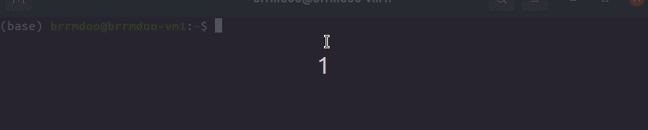

# AWS S3 Autocomplete for `aws s3` commands

## Autocomplete Demo



Autocomplete helper for the `aws s3` commands that:

- Lists **buckets** when you type `s3://`
- Lists **folders and files** inside buckets

## Features

✅ Bucket suggestions with `s3://` prefix  
✅ Folder and file suggestions using AWS S3 API  
✅ Smooth Bash integration  
✅ Lightweight and easy to install  
✅ No external dependencies besides AWS CLI

---

## Prerequisites

Before using this tool, make sure the folowing prerequisites are met:
- **AWS CLI v2** must be installed.
    Check the version with:
    ```bash
    aws --version
    ```
- **AWS CLI** must be configured.
    ```bash
    aws configure
    ```

## Instalation

### 1. Clone the repo

```bash
git clone git@github.com:airmaxell/s3_auto_complete.git
```

### 2. Run installation

```bash
cd s3_auto_complete
./install.sh
```

Enjoy!
